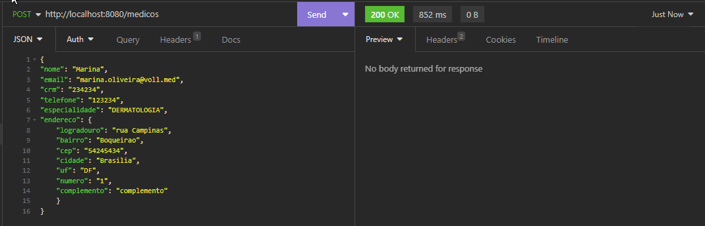
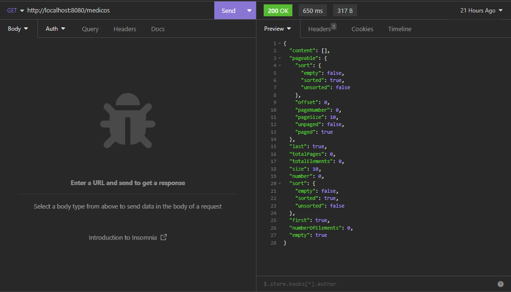
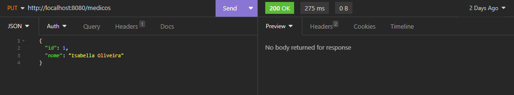
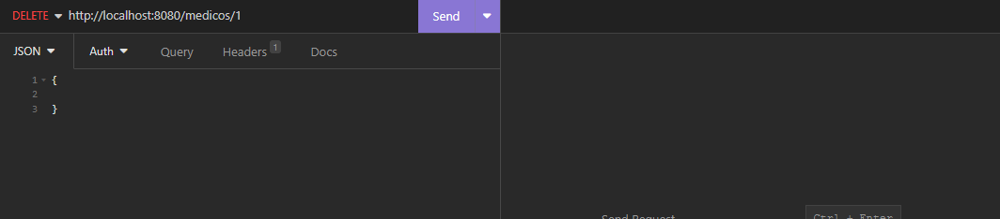

## 💻 Sobre o projeto

Voll.med é uma clínica médica fictícia que precisa de um aplicativo para gestão de consultas. O aplicativo deve possuir funcionalidades que permitam o cadastro de médicos e de pacientes, e também o agendamento e cancelamento de consultas.

Enquanto um time de desenvolvimento será responsável pelo aplicativo mobile, o nosso será responsável pelo desenvolvimento da API Rest desse projeto.

---

## ⚙️ Funcionalidades

- [x] CRUD de médicos;
- [x] CRUD de pacientes;
- [X] Login de Usuarios 
- [ ] Agendamento de consultas(em breve);
- [ ] Cancelamento de consultas(em breve);

---

## 🎨 Layout

O layout da aplicação mobile está disponível neste link: <a href="https://www.figma.com/file/N4CgpJqsg7gjbKuDmra3EV/Voll.med">Figma</a>

---

## 📄 Documentação

A documentação das funcionalidades da aplicação pode ser acessada neste link: <a href="https://trello.com/b/O0lGCsKb/api-voll-med">Trello</a>

---

## 🛠 Tecnologias

As seguintes tecnologias foram utilizadas no desenvolvimento da API Rest do projeto:

- **[Java 17](https://www.oracle.com/java)**
- **[Spring Boot 3](https://spring.io/projects/spring-boot)**
- **[Maven](https://maven.apache.org)**
- **[MySQL](https://www.mysql.com)**
- **[Hibernate](https://hibernate.org)**
- **[Flyway](https://flywaydb.org)**
- **[Lombok](https://projectlombok.org)**

---

## 📝 CRUD 

Usamos a ferramenta, IntelliJ

-----------------------------------------------------------------------------------------------------------------------------

# MEDICOS 

# POST 

# GET 

# PUT  

# DELETE 

-----------------------------------------------------------------------------------------------------------------------------

# PACIENTES  

# POST 

# GET 

# PUT  

# DELETE 

-----------------------------------------------------------------------------------------------------------------------------

# LOGIN
Perceba que ao fazer login, o usuário gera um token, esse token, deve ser passado no Header da requisição, 
caso ele não seja passado, o usuário terá acesso a outras rotas da aplicação

vamos efetuar o login:

Confira que o usuario que se loga possui um token que é gerado no momento da requisição. Caso esse token não 
seja passado no momento da requisição, o usuário não terá autorização para as rotas do sistema. Mas a partir 
do momento que esse token é passado, o usuário pode acessar as rotas da nossa API. 

